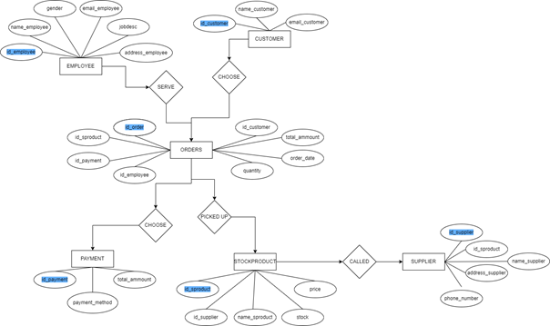
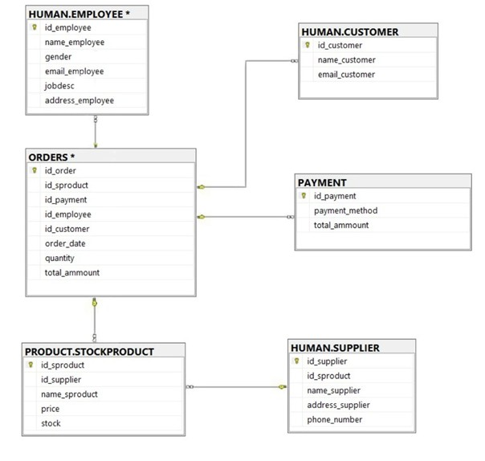

# DATABASE IN DUM-DUM

## 📖 Project Overview
`DATABASE IN DUM-DUM` is a database project developed to manage sales data of beverages and goods in a fictional business called Dum-Dum. This project includes database schema design, strict data validation, implementation of stored procedures, use of triggers, and the creation of a view to support data visualization. It was developed to fulfill a final project requirement for a Database course and reflects best practices in relational database system development.

## 🧩 Project Objectives
- Build a well-structured and efficient database system
- Apply data validation to ensure data integrity
- Use stored procedures to simplify data operations
- Record data changes using triggers
- Display data using a view for easier analysis

## 🧰 Technologies & Tools
- **Database Management System**: Microsoft SQL Server
- **Diagram Tools**: Draw.io (for creating ERD and schematic diagrams)
- **IDE**: SQL Server Management Studio (SSMS)
- **Documentation**: Microsoft Word

## 🧠 System Workflow
1. **ERD Design**: Illustrates relationships between entities such as employees, customers, products, and transactions.
2. **Database Schema Design**: Divided into two main schemas: `HUMAN` (for personal data) and `PRODUCT` (for product and stock data).
3. **Table Creation**: Defines fields, data types, field lengths, and constraints like `PRIMARY KEY`, `FOREIGN KEY`, and `CHECK`.
4. **Validation**: Applied on various fields (e.g., email and phone number) to ensure proper format.
5. **Data Insertion**: Data is inserted manually or via `stored procedures`.
6. **Triggers**: Used to display notifications when data is inserted or updated in certain tables.
7. **View**: A view named `Menu` is created to join and present data from related tables.

## 🗃️ Schema & Table Structure
### `HUMAN` Schema
- **EMPLOYEE**: Employee data (name, position, email, address)
- **CUSTOMER**: Customer data (name and email)
- **SUPPLIER**: Supplier data (including phone and address)

### `PRODUCT` Schema
- **STOCKPRODUCT**: Available products and their stock
- **BARANG**: Additional items such as VGA, SSD, RAM
- **ORDERS**: Customer orders
- **SUPPLIER**: Duplicated supplier for product needs

### Other Tables
- **PAYMENT**: Payment data (method and total amount)
- **TRANSACTION**: Records of customer purchases
- **VIEW Menu**: A simplified view of order-related data

## 🛡️ Validation Examples
- Employee ID: `id_employee` → must start with `E` (e.g., `E001`)
- Email: `email_customer` → must end with `@gmail.com`
- Phone Number: `phone_number` → must begin with `08`
- Product ID: `id_sproduct` → must start with `SPR` (e.g., `SPR001`)

## 🔁 Stored Procedures & Triggers
### Available Stored Procedures:
- `SPALL`: Displays data from all tables
- `InsertCustomer`: Adds a new customer
- `sp_UpdateCustomer`: Updates customer data
- `DeleteCustomerByID`: Deletes a customer by ID
- `SPINPUTDATAPEGAWAI`: Adds a new employee

### Triggers:
- `TRINPUTBARANG`: Displays a notification when a new product is inserted
- `UPDATEPRODUCT_Log`: Logs updates to product data
- `DeleteSTOCKPRODUCT_Log1`: Logs product deletion events

## 👁️‍🗨️ View: Menu
```sql
CREATE VIEW Menu AS
SELECT o.id_order, p.name_product AS product_name, p.price
FROM ORDERS o
JOIN PRODUCT.STOCKPRODUCT p ON o.id_sproduct = p.id_sproduct;
```

## 📷 Screenshots
### Entity Relationship Diagram (ERD)


### Schematic Diagram


## 📄 Full Documentation
Refer to the following file for a comprehensive report that includes system explanation, table designs, ERD, and analytical processes:
- [`[PROJECT 3] DATABASE IN DUM DUM.docx`](./[PROJECT%203]%20DATABASE%20IN%20DUM%20DUM.docx)

## 🔧 How to Run This Project
1. Open Microsoft SQL Server Management Studio (SSMS)
2. Run the command:
   ```sql
   CREATE DATABASE DUMDUM;
   USE DUMDUM;
   ```
3. Create all schemas and tables based on the `DUMDUM.sql` file
4. Run `EXEC SPALL` to view all data
5. Use `EXEC` with stored procedures to insert or update data
6. Use the `Menu` view to see a summary of orders

## 👨‍💻 Developers
- Leann Nataly Kenan Pakpahan
- Salma Aufa Ramadhanti Iswara
- Techi Kariska Sari

## 📅 Project Timeline
- **Start**: December 14, 2023
- **End**: December 28, 2023
